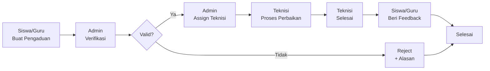

# 🏫 SFCS - School Facility Complaint System

<div align="center">


**Sistem Manajemen Pengaduan Fasilitas Sekolah yang Modern & Efisien**

[](LICENSE.md)
[](https://php.net)
[](https://laravel.com)
[]()

[📖 Instalasi](#-instalasi) • [✨ Fitur](#-fitur-utama) • [📱 Screenshot](#-screenshot) • [📞 Support](#-support)

</div>

---

## 🎯 Tentang SFCS

**SFCS (School Facility Complaint System)** adalah sistem manajemen pengaduan fasilitas sekolah berbasis web yang dirancang khusus untuk membantu sekolah mengelola laporan kerusakan fasilitas dengan lebih terorganisir, cepat, dan transparan.

### Kenapa SFCS?

✅ **Efisien** - Proses pengaduan dari laporan hingga selesai dalam satu sistem  
✅ **Transparan** - Siswa/guru bisa track status pengaduan real-time  
✅ **Terorganisir** - Semua pengaduan tercatat dengan rapi, tidak ada yang terlewat  
✅ **Mobile-Friendly** - Bisa diakses dari HP, tablet, atau komputer  
✅ **PWA Ready** - Bisa diinstall seperti aplikasi di smartphone  
✅ **Notifikasi Real-time** - Update otomatis via browser notification  

---

## 📋 Dokumentasi Lengkap

| Dokumen | Deskripsi |
|---------|-----------|
| **[DEVELOPER-HANDOFF.md](DEVELOPER-HANDOFF.md)** | 🧠 Catatan handoff developer, setup Windows, `.env`, command, struktur project, dan mapping fitur |
| **[QUICK-START.md](QUICK-START.md)** | 🚀 Panduan cepat untuk memulai (BACA INI DULU!) |
| **[INSTALLATION.md](INSTALLATION.md)** | 📦 Panduan instalasi lengkap (cPanel & VPS) |
| **[README.md](README.md)** | 📚 Dokumentasi sistem & fitur detail |
| **[LICENSE.md](LICENSE.md)** | ⚖️ Informasi lisensi & harga |
| **[CHANGELOG.md](CHANGELOG.md)** | 📝 Riwayat update & perubahan |

---

## ✨ Fitur Utama

### 👥 Multi-Role Management
| Role | Akses & Fungsi |
|------|----------------|
| **Siswa** | Buat pengaduan, upload foto, track status, beri feedback |
| **Guru** | Sama seperti siswa + laporan khusus staf pengajar |
| **Teknisi** | Terima tugas, update progress, tandai selesai |
| **Admin** | Verifikasi pengaduan, assign ke teknisi, reject invalid |
| **Kepala Sekolah** | Dashboard monitoring, laporan, analisis data |
| **Super Admin** | Full access, kelola user, settings sistem |

### 🔔 Sistem Notifikasi Cerdas
- **Real-time Browser Notification** - Update langsung tanpa refresh
- **Multi-channel** - In-app notification + optional email
- **Role-based** - Notifikasi sesuai peran user
- **Action-oriented** - Link langsung ke pengaduan terkait

### 📊 Dashboard & Laporan
- **Statistik Real-time** - Total pengaduan, status, response time
- **Visual Charts** - Grafik per kategori, gedung, prioritas
- **Export Reports** - Export ke Excel untuk analisis lebih lanjut
- **Filter Advanced** - Filter by tanggal, status, kategori, gedung

### 📱 Progressive Web App (PWA)
- **Installable** - Bisa diinstall di smartphone seperti aplikasi native
- **Offline Support** - Beberapa fitur tetap berfungsi offline
- **Push Notifications** - Notifikasi langsung ke device (coming soon)
- **Fast Loading** - Optimized performance dengan caching

### 🔐 Keamanan & Privacy
- **Authentication** - Login dengan email & password terenkripsi
- **Authorization** - Role-based access control (RBAC)
- **Session Management** - Auto logout, remember me option
- **Data Encryption** - Password di-hash dengan bcrypt
- **CSRF Protection** - Laravel built-in security

---

## 🖥️ Teknologi Stack

### Backend
- **Framework**: Laravel 12.x
- **PHP**: 8.2+
- **Database**: MySQL 5.7+ / MariaDB 10.3+
- **Authentication**: Laravel Breeze
- **Queue**: Database queue driver

### Frontend
- **UI Framework**: Tailwind CSS 3.x
- **JavaScript**: Vanilla JS + Alpine.js
- **Build Tool**: Vite
- **Icons**: Heroicons
- **Charts**: Chart.js (optional)

### Infrastructure
- **Web Server**: Apache / Nginx
- **Caching**: File-based / Redis (optional)
- **Storage**: Local filesystem / S3 compatible
- **Email**: SMTP (Gmail, Mailgun, etc)

---

## 📦 Instalasi

### Minimum Requirements
- PHP 8.2 or higher
- MySQL 5.7+ atau MariaDB 10.3+
- Composer
- Node.js 18+ & NPM
- 512 MB RAM minimum (1 GB recommended)
- 500 MB disk space

### Quick Installation

1. **Download & Extract**
   ```bash
   # Extract downloaded package
   unzip SFCS-v1.1.0.zip
   cd SFCS
   ```

2. **Install Dependencies**
   ```bash
   cd sfcs-app
   composer install --optimize-autoloader --no-dev
   npm install && npm run build
   ```

3. **Configure Environment**
```bash
cp .env.example .env
# Edit .env dengan database & email settings
php artisan key:generate
```

Gunakan user database aplikasi seperti `sfcs_user`, jangan `root`. Untuk setup lokal awal, driver `file/sync` pada session, cache, dan queue lebih aman.

4. **Setup Database**
```bash
php artisan migrate --force
php artisan db:seed --force
php artisan app:doctor
```

5. **Set Permissions**
   ```bash
   chmod -R 775 storage bootstrap/cache
   ```

6. **Access & Login**
   - URL: `https://your-domain.com`
   - Email: `superadmin@sfcs.sch.id`
   - Password: `password`

**📖 Untuk panduan instalasi lengkap, lihat [INSTALLATION.md](INSTALLATION.md)**

---

## 📱 Screenshot

### Dashboard Super Admin


### Form Pengaduan (Mobile)


### Detail Pengaduan & Timeline


### Kelola Pengaduan (Admin)


---

## 🔄 Workflow Sistem



**Penjelasan Workflow:**
1. **Siswa/Guru** membuat pengaduan dengan foto & deskripsi
2. **Admin** menerima notifikasi & verifikasi pengaduan
3. Jika **valid**, admin assign ke teknisi yang sesuai
4. Jika **tidak valid**, admin reject dengan alasan
5. **Teknisi** menerima tugas & mulai perbaikan
6. **Teknisi** update progress & tandai selesai
7. **Siswa/Guru** memberi feedback & rating
8. Pengaduan selesai & masuk ke riwayat

---

## 🎓 Panduan Penggunaan

### Untuk Siswa/Guru

1. **Login** ke sistem dengan email sekolah
2. Klik menu **"Buat Pengaduan"**
3. Isi form:
   - Judul pengaduan
   - Deskripsi detail
   - Kategori (AC, Listrik, dll)
   - Lokasi (Gedung & Ruangan)
   - Upload foto kerusakan (max 5 foto)
4. Klik **"Kirim Pengaduan"**
5. Tunggu verifikasi dari admin
6. Track status di menu **"Pengaduan Saya"**
7. Beri feedback setelah selesai

### Untuk Admin

1. Login sebagai admin
2. Cek **"Kelola Pengaduan"** untuk pengaduan baru
3. Review detail pengaduan
4. **Verifikasi** atau **Tolak** pengaduan
5. Jika valid, **Assign** ke teknisi yang tepat
6. Monitor progress teknisi
7. Lihat laporan di dashboard

### Untuk Teknisi

1. Login sebagai teknisi
2. Lihat **"Tugas Saya"** untuk assignment
3. Klik pengaduan untuk lihat detail
4. Update status: **Diterima** → **Proses** → **Selesai**
5. Upload foto hasil perbaikan (optional)
6. Tandai **"Selesai"** jika perbaikan sudah tuntas

### Untuk Kepala Sekolah

1. Login sebagai kepala sekolah
2. Lihat **Dashboard** untuk overview
3. Cek grafik & statistik pengaduan
4. Generate **Laporan** per periode
5. Analisis data untuk improvement fasilitas

---

## 🔧 Konfigurasi & Customization

### Ubah Logo & Nama Sekolah
```bash
# Upload logo ke:
sfcs-app/public/images/logo.png

# Edit .env:
APP_NAME="SFCS - Nama Sekolah Anda"
```

### Setup Email Notifikasi
Edit `.env`:
```env
MAIL_MAILER=smtp
MAIL_HOST=smtp.gmail.com
MAIL_PORT=587
MAIL_USERNAME=email@sekolah.sch.id
MAIL_PASSWORD=app_password
MAIL_FROM_ADDRESS=noreply@sekolah.sch.id
MAIL_FROM_NAME="SFCS Sekolah"
```

### Tambah Gedung & Ruangan
1. Login sebagai Super Admin
2. Menu **"Gedung & Ruangan"**
3. Klik **"Tambah Gedung"**
4. Isi nama gedung & jumlah lantai
5. Tambahkan ruangan untuk setiap gedung

### Konfigurasi Kategori
1. Menu **"Kategori"**
2. Tambah kategori utama (AC, Listrik, Furniture)
3. Tambah sub-kategori untuk detail spesifik

---

## 🐛 Troubleshooting

### Error 500 - Internal Server Error
```bash
# Check logs
tail -50 storage/logs/laravel.log

# Clear cache
php artisan cache:clear
php artisan config:clear

# Fix permissions
chmod -R 775 storage bootstrap/cache
```

### Database Connection Error
```bash
# Test connection
php artisan tinker
>>> DB::connection()->getPdo();

# Check .env settings
DB_HOST=localhost
DB_DATABASE=your_database
DB_USERNAME=your_username
DB_PASSWORD=your_password
```

### Email Tidak Terkirim
```bash
# Test email
php artisan tinker
>>> Mail::raw('Test', function($msg) { $msg->to('test@email.com'); });

# Check SMTP settings di .env
# Check firewall tidak block port 587
```

**Untuk troubleshooting lengkap, lihat [INSTALLATION.md](INSTALLATION.md#-troubleshooting)**

---

## 📊 Statistik Sistem

- **Total Lines of Code**: ~15,000 lines
- **Database Tables**: 14 tables
- **Migrations**: 12 migration files
- **Controllers**: 8 controllers
- **Models**: 12 models
- **Blade Views**: 50+ views
- **Routes**: 60+ routes
- **Middleware**: 5 custom middleware

---

## 🔄 Update & Maintenance

### Check for Updates
```bash
# Check current version
php artisan --version

# Update dependencies
composer update
npm update && npm run build

# Run new migrations (if any)
php artisan migrate --force
```

### Backup Database
```bash
# Manual backup
mysqldump -u username -p database_name > backup_$(date +%Y%m%d).sql

# Restore backup
mysql -u username -p database_name < backup_20260208.sql
```

### Performance Optimization
```bash
# Cache configurations
php artisan config:cache
php artisan route:cache
php artisan view:cache

# Optimize autoloader
composer dump-autoload -o
```

---

## ⚖️ Lisensi & Harga

SFCS adalah **commercial software** dengan lisensi per-sekolah.

### 💰 Harga Lisensi

| Paket | Harga | Fitur |
|-------|-------|-------|
| **Standard** | Rp 5,000,000 | Single domain, 6 bulan support, 12 bulan updates |
| **Premium** | Rp 7,500,000 | Single domain, 12 bulan support, 24 bulan updates, 10 jam konsultasi |
| **Enterprise** | Custom | Multiple domains, unlimited support, lifetime updates, custom features |

**Volume Discount**: 5+ sekolah = diskon 20%

📄 **Detail lengkap lisensi: [LICENSE.md](LICENSE.md)**

---

## 📞 Support

### Kontak Developer
- **Email**: support@xdzaky.my.id
- **WhatsApp**: +62-xxx-xxxx-xxxx (coming soon)
- **Website**: https://xdzaky.my.id
- **GitHub**: https://github.com/xDzaky

### Support Coverage
- ✅ 6 bulan email support (Standard)
- ✅ 12 bulan email support (Premium)
- ✅ Unlimited support (Enterprise)
- ✅ Response time: 1-2 hari kerja
- ✅ Bug fixes & security patches

### Resources
- 📖 [Documentation](sfcs-app/README.md)
- 🚀 [Quick Start Guide](QUICK-START.md)
- 🔧 [Technical Specs](tech-spec-document.md)
- 📝 [Changelog](sfcs-app/CHANGELOG.md)

---

## 🙏 Acknowledgments

Terima kasih kepada:
- **Laravel** - The PHP Framework for Web Artisans
- **Tailwind CSS** - A utility-first CSS framework
- **Alpine.js** - Lightweight JavaScript framework
- **Heroicons** - Beautiful hand-crafted SVG icons
- Semua sekolah yang telah mempercayai SFCS

---

## 📜 Version History

| Version | Date | Highlights |
|---------|------|------------|
| **v1.1.0** | Feb 2026 | PWA support, notification overhaul, mobile-first redesign |
| **v1.0.0** | Jan 2026 | Initial release with core features |

**Full changelog: [CHANGELOG.md](sfcs-app/CHANGELOG.md)**

---

## 🎉 Selamat Datang di SFCS!

Terima kasih telah memilih SFCS untuk sekolah Anda. Kami berkomitmen untuk terus mengembangkan sistem ini agar semakin baik dan membantu sekolah dalam mengelola fasilitas dengan lebih efektif.

**Butuh bantuan? Jangan ragu untuk menghubungi support!**

---

<div align="center">

**© 2026 SFCS - School Facility Complaint System**  
**Developed with ❤️ by xDzaky**

[🏠 Website](https://xdzaky.my.id) • [📧 Email](mailto:support@xdzaky.my.id) • [📱 WhatsApp](#)

</div>
